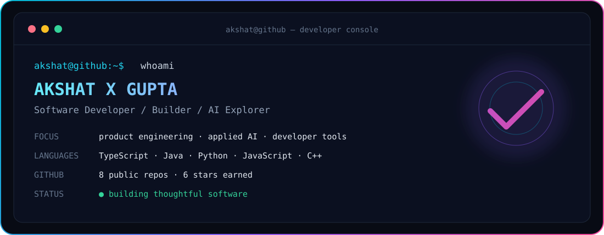

<div align="center">



<p>
  <a href="https://github.com/akshat12345212"></a>
  
</p>

</div>




<br />



## About

I am a developer who enjoys taking ideas from rough sketches to working software. My interests sit at the intersection of **product engineering**, **AI-powered experiences**, and **developer tools**—with a constant focus on clarity, usefulness, and craft.

```yaml
currently:
  learning: [system design, applied AI, stronger engineering patterns]
  building: [useful products, developer tools, ambitious experiments]
  values: [curiosity, clean execution, continuous improvement]
```

## Toolbox

<div align="center">


<br /><br />


</div>

## What I enjoy building

|  | Area | What draws me to it |
| :---: | --- | --- |
| `01` | Product engineering | Turning complex ideas into interfaces that feel natural |
| `02` | AI experiments | Finding practical uses for intelligent systems |
| `03` | Developer tools | Removing friction from how people build and create |
| `04` | Algorithms & systems | Understanding the foundations behind reliable software |

## GitHub metrics

<div align="center">



</div>

## Current direction

- Sharpening my ability to design and ship complete products
- Exploring where AI creates genuine utility instead of novelty
- Building stronger foundations in architecture, algorithms, and systems
- Learning in public and improving the quality of every iteration


<div align="center">

### Curious minds build interesting things.

<sub>Always learning. Always building.</sub>

</div>
